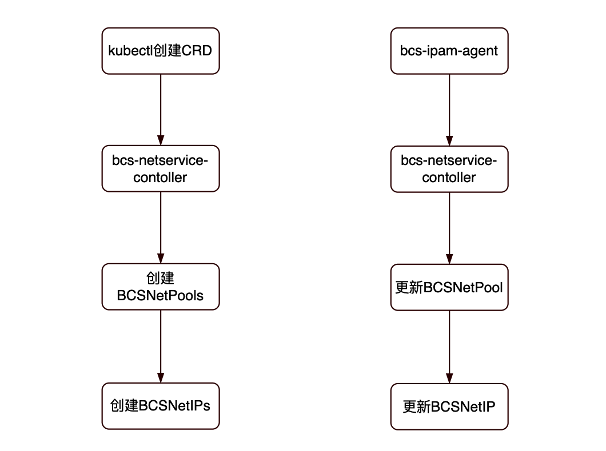

# bcs ipam网络方案

## 背景

原bcs-netservice部署复杂，多用于mesos集群，且需要使用ZK作为后端存储。为解决这些问题，决定抽象出BCSNetPool和BCSNetIP两个CRD，方便在 k8s集群中部署和管理。

## 架构设计



使用kubectl创建CRD，bcs-netservice-controller根据BCSNetPool创建BCSNetIP

当客户端申请IP时，bcs-netservice-controller会更新相应的BCSNetPool和BCSNetIP

## 数据结构

- BCSNetPool表明网络池的基本信息和状态

```
// BCSNetPoolSpec defines the desired state of BCSNetPool
type BCSNetPoolSpec struct {
	// 网段掩码
	Mask int `json:"mask,omitempty"`
	// 网段网关
	Gateway string `json:"gateway,omitempty"`
	// 对应主机列表
	Hosts []string `json:"hosts,omitempty"`
	// 可用IP
	AvailableIPs []string `json:"availableIPs,omitempty"`
}

// BCSNetPoolStatus defines the observed state of BCSNetPool
type BCSNetPoolStatus struct {
	// Initializing --初始化中，Normal --正常
	Status         string `json:"status,omitempty"`
	CreateTime     string `json:"createTime,omitempty"`
	UpdateTime     string `json:"updateTime,omitempty"`
	AvailableIPNum int    `json:"availableIPNum,omitempty"`
	// 已使用IP
	ActiveIPs   []string `json:"activeIPs,omitempty"`
	ActiveIPNum int      `json:"activeIPNum,omitempty"`
	// 保留的IP
	ReservedIPs   []string `json:"reservedIPs,omitempty"`
	ReservedIPNum int      `json:"reservedIPNum,omitempty"`
}
```

- BCSNetIP表明某个IP的基本信息和状态

```
// BCSNetIPSpec defines the desired state of BCSNetIP
type BCSNetIPSpec struct {
	// 所属Pool
	Pool    string `json:"pool,omitempty"`
	Mask    int    `json:"mask,omitempty"`
	Gateway string `json:"gateway,omitempty"`

	// 容器ID
	Container string `json:"container,omitempty"`
	// 对应主机信息
	Host string `json:"host"`
}

// BCSNetIPStatus defines the observed state of BCSNetIP
type BCSNetIPStatus struct {
	// Active --已使用，Available --可用, Reserved --保留
	Status       string `json:"status,omitempty"`
	PodName      string `json:"podName,omitempty"`
	PodNamespace string `json:"podNamespace,omitempty"`
	CreateTime   string `json:"createTime,omitempty"`
	UpdateTime   string `json:"updateTime,omitempty"`
}
```

